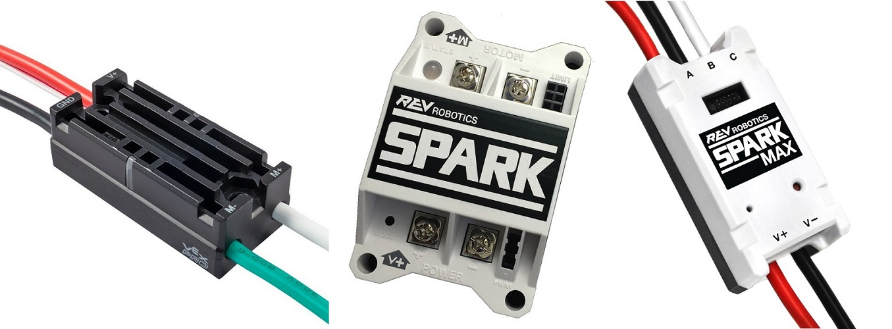
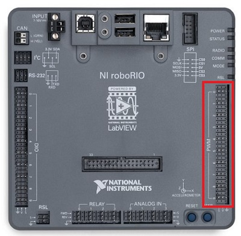

# Contrôler un moteur

## Les contrôleurs moteur

Pour contrôler les moteurs présents sur le robot, nous avons besoin de contrôleurs moteurs. En un mot, ceux-ci recoivent un signal de faible intensité de la part du RoboRio et envoient au moteur un signal de plus forte intensité. Voici quelques exemples de contrôleurs moteur que nous utilisons : VictorSP, Spark et SparkMax.



## PWM et CAN

Il y a 2 manières de contrôler ceux-ci : en PWM ou en CAN. Tous les contrôleurs supportent le PWM mais seulement une partie d'entre eux supporte le CAN.

La principale différence entre les deux modes de transmission est que le PWM ne peut commander que la vitesse du moteur tandis que le CAN permet des contrôles plus avancés et la communication d'informations entre le contrôleur et le RoboRio.


La méthode la plus simple est le PWM. Elle nous permet de contrôler rapidement le moteur voulu en branchant le cable du contrôleur sur le bon port PWM du RoboRio (encadrés en rouge).



## Dans le Code

Du côté du RoboRio, il nous suffit de créer un objet correspondant au contrôleur pour pouvoir asservir le moteur. WpiLib propose une classe pour chaque contrôleur. En fait, avec le PWM, ces classes sont toutes identiques car elles dérivent toutes de la même classe `PWMSpeedController`. Cependant, elles ont été dérivées sous plusieurs noms :
```c++
#include <frc/VictorSP.h>
#include <frc/Spark.h>
#include <frc/PWMVictorSPX.h>
```
Remarquez que `VictorSPX` est précédé de `PWM`, c'est parce qu'il peut être controllé via le CAN. Pour différencier les 2 classes (qui sont totalement différentes), celui-ci se nomme donc `PWMVictorSPX`.

Quand on crée un objet qui représente un contrôleur PWM, on doit spécifier dans le constructeur le port sur lequel il est branché. Par exemple, pour un VictorSP branché sur le port n°0 :
```c++
frc::VictorSP mon_moteur(0);
```

On a ensuite accès à tout un tas de méthodes qui nous permettent de contrôler le moteur.

Pour "donner" une puissance voulue à un moteur, on utilise la méthode : `void Set(double value)` qui attend en argument un double entre -1 (pleine puissance vers l'arrière) et 1 (pleine puissance vers l'avant). Si je veux faire tourner mon moteur à la moitié de sa vitesse maximum :
```c++
mon_moteur.Set(0.5);
```

On a aussi `void StopMotor()` qui remplace `Set(0)` et `void SetInverted(bool isInverted)` qui inverse la direction du moteur si on lui donne comme argument `true`.
```c++
mon_moteur.SetInverted(true);

mon_moteur.StopMotor();
```
