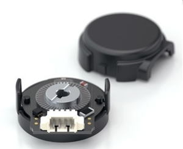
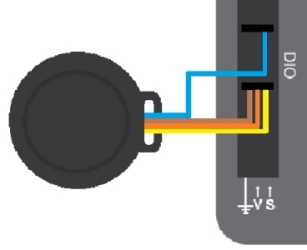

# Utiliser les capteurs

Maintenant que l'on sait faire bouger notre robot, faisons le bouger intelligement. Mais cela n'est pas possible si nous n'avons pas d'indications sur l'état du robot. C'est pourquoi nous utilisons des capteurs.


## Limit switch

### Description

L'un des types de capteur les plus simple à utiliser est le limit switch. C'est un interrupteur qui revient à sa place quand il n'est pas pressé (un bouton poussoir).


Ce capteur nous permet de savoir si un mecanisme a atteint un certain point. Par exemple, un limit switch situé au bout d'un bras pivotant peut nous dire si le bras touche le bord du robot.

Un limit switch se branche aux ports DIO du Roborio grâce à deux cables. Un va sur le ground (&#9178;) et l'autre sur le signal (S). Pourtnat, le switch possède souvent 3 connecteurs : Normally Open (NO), Normally Closed (NC), et ground (C ou COM). Normally Open signifie que le switch est normalement non-pressé. Quand il sera pressé, un message sera envoyé au Roborio. Normally Closed signifie le contraire. Connectez un des cables au connecteur NO ou NC, et l'autre au ground.

### Dans le Code

Pour programmer un limit switch, créez une instance de la classe [DigitalInput](http://first.wpi.edu/FRC/roborio/release/docs/cpp/classfrc_1_1DigitalInput.html), son constructeur attend comme argument le port DIO sur lequel le switch est branché :
```c++
#include <frc/DigitalInput.h>
frc::DigitalInput mon_switch(0);
```

La méthode `bool Get()` renvoie `true` ou `false` suivant la position du switch (appuyé/relaché) et ses branchements (NO/NC) :
```c++
bool switchPresse = mon_switch.Get();
```


<br>
## Encodeurs

### Description

Les encodeurs permettent de connaitre la position précise d'un mécanisme. Ils se fixent sur des axes et comptent le nombre de tours que ceux-ci font. Ce sont des sortes de compteurs : quand l'axe tourne dans un sens la "position" augmente, quand il tourne dans le sens inverse la "position" diminue. Les encodeurs peuvent être optiques ou bien magnétiques.



Voici la façon dont il se branche :



### Dans le Code

Pour programmer un encodeur, créez une instance de la classe [Encoder](http://first.wpi.edu/FRC/roborio/release/docs/cpp/classfrc_1_1Encoder.html), son constructeur attend comme argument les port DIO sur lequels l'encodeur est branché :
```c++
#include <frc/Encoder.h>
frc::Encoder mon_encodeur(0, 1);
```

La méthode `int Get()` renvoie la distance angulaire mesurée par l'encodeur en ticks. Selon le modèle, un tour équivaut à 360 ticks, 22 ticks, ... :
```c++
double distance = mon_encodeur.Get();
```

La méthode `void Reset()` remet le compteur à zéro :
```c++
mon_encodeur.Reset();
```

Les méthodes `void 	SetDistancePerPulse(double distancePerPulse)` et `double GetDistance()` permettent de convertir automatiquement les tick en une autre unité :
```c++
// 1 tour équivaut à 360 ticks
mon_encodeur.SetDistancePerPulse(1.0/360);
double nombreDeTours = mon_encodeur.GetDistance();
```

La méthode `void GetRate()` renvoie la vitesse actuelle convertie en distance selon le facteur de conversion (1 par défaut) :
```c++
double vitesse = mon_encodeur.GetRate();
```


<br>
## Gyroscopes

### Description

Les gyroscopes permettent de connaître la vitesse et le sens de rotation du robot. Ils permettent aussi de connaître l'angle du robot sur le terrain. Ils peuvent se brancher sur le port SPI ou les ports Analog In 0 et 1 du Roborio.

### Dans le Code

Pour programmer un gyroscope, créez une instance de la classe [ADXRS450_Gyro](http://first.wpi.edu/FRC/roborio/release/docs/cpp/classfrc_1_1ADXRS450__Gyro.html) (SPI) ou [AnalogGyro](http://first.wpi.edu/FRC/roborio/release/docs/cpp/classfrc_1_1AnalogGyro.html) (Analog In) en fonction du gyroscope. Le constructeur d'`AnalogGyro` attend comme argument le port Analog In (0 ou 1) sur lequel le gyroscope est branché :
```c++
#include <frc/ADXRS450_Gyro.h>
frc::ADXRS450_Gyro mon_gyro();
```
```c++
#include <frc/AnalogGyro.h>
frc::AnalogGyro mon_gyro(0);
```

La méthode `double GetAngle()` renvoie l'angle du robot en degrés dans le sens des aguilles d'une montre :
```c++
double angle = mon_gyro.GetAngle();
```

La méthode `double GetRate()` renvoie la vitesse de rotation du robot en degrés par secondes dans le sens des aguilles d'une montre :
```c++
double vitesseRotation = mon_gyro.GetRate();
```

La méthode `void Calibrate()` calibre le gyroscope en définissant son centre. La méthode `void Reset()` remet le gyroscope à zéro :
```c++
// Initialisation du gyro
mon_gyro.Calibrate();
mon_gyro.Reset();
```