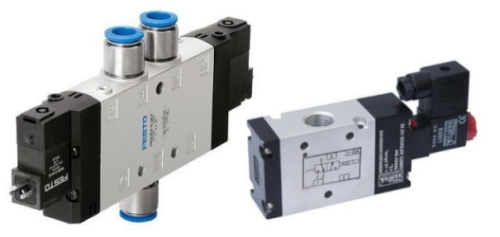
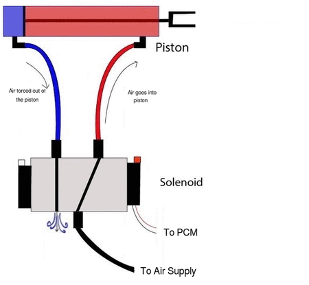

# Utiliser la Pneumatique

Nous avons appris comment contrôler les moteurs et les capteurs du robot. Mais ces éléments ne sont pas les seuls présents sur le robot : il peut aussi y avoir de la pneumatique.


Le circuit pneumatique est composé de tous les éléments utilisant l'air compressé au sein du robot : un **compresseur**, de **réservoirs d'air** (air tanks), de jauges de pression, de **solénoïdes** et de **vérins**.

Les vérins sont les seuls actionneurs utilisant la pneumatique, ils sont utilisés pour des mouvements rapides ne nécessitant que 2 positions (rentré/sorti).



Les solénoïdes (ou solenoid valves) contrôlent le flux d'air. Ils permettent de diriger ou non l'air dans un vérin. Il existe 2 types de solénoïdes : les solénoïdes simple et doubles. Ils sont contrôlés par le PCM (Pneumatic Control Module) et se branchent donc sur les différents ports que celui-ci possède.


## Solénoïdes simples

Les solénoïdes simples peuvent seulement appliquer ou bloquer la pression de leur unique sortie. Ils ne peuvent ainsi appliquer une pression qu'à une seule entrée d'un vérin. Ils sont utiles lorsqu'une force extérieur (gravité, ...) permet de rentrer/sortir le vérin ou bien lorsque le vérin n'est utilisé qu'une seule fois (Sorti mais jamais rentré).

### Dans le code

Pour programmer un solénoïde simple, il faut créer une instance de la classe [Solenoid](http://first.wpi.edu/FRC/roborio/release/docs/cpp/classfrc_1_1Solenoid.html), son constructeur attend comme argument le port sur lequel le solenoid est branché :
```c++
#include <frc/Solenoid.h>
frc::Solenoid mon_solenoide(0);
```

La méthode `void Set(bool on)` permet d'ouvrir ou de fermer le solénoïde :
```c++
// Je sors le vérin
mon_solenoide.Set(true);
```

!!! note "Note"
    Quand on déclare une instance d'un solénoïde (simple ou double), le compresseur est automatiquement mis en route.


## Solénoïdes doubles

Les solénoïdes possèdent une entrée et deux sorties. La pression peut donc être appliquée à une sortie, à l'autre ou bien à aucune des deux. Quand un solénoïde double est branché à un vérin, il peut ainsi le sortir, le rentrer ou bien le laisser "libre".

{ width=400px }

### Dans le code

La classe [DoubleSolenoid](http://first.wpi.edu/FRC/roborio/release/docs/cpp/classfrc_1_1DoubleSolenoid.html) est similaire à la classe Solenoid. Son constructeur attend comme argument les 2 ports (Forward et Reverse) sur lequel le solenoid est branché :
```c++
#include <frc/DoubleSolenoid.h>
frc::DoubleSolenoid mon_solenoide(0, 1);
```

La méthode `void Set(Value value)` permet de contrôler l'état du solénoïde. Il attend en argument une des valeur de l'enum `Value` : Off, Forward or Reverse : 
```c++
// Je sors le vérin
mon_solenoide.Set(frc::DoubleSolenoid::Value::kForward);

// Je rentre le vérin
mon_solenoide.Set(frc::DoubleSolenoid::Value::kReverse);

// Je laisse le vérin libre
mon_solenoide.Set(frc::DoubleSolenoid::Value::kOff);
```