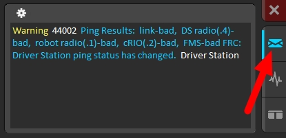

# Communiquer avec le robot

Une des notions que nous n'avons pas encore abordée et la communication entre le robot et l'ordinateur du pilote. Afficher des messages ou des valeurs numériques peut en effet être très utile tant pour faire des tests qu'en compétition.


## Cout et Printf()

La première méthode à notre disposition est d'utiliser l'affichage console classique du C++ (`cout` et `printf()`). Le flux de sortie du robot est en effet redirigé sur le réseau. On peut le lire directement sur la Driver Station.



On peut aussi lire le flux de sortie du robot avec le RioLog. On peut lancer le RioLog dans VS Code en entrant `riolog` dans la palette de commandes (++ctrl+shift+p++) puis en sélectionnant `WpiLib: Start RioLog`.


## SmartDashboard

Afficher des informations avec `cout` pose un problème : si on affiche régulièrement plusieurs messages, il peut devenir très compliqué de suivre le défilement de ceux-ci. Pour cela, une alternative existe : c'est le [SmartDashboard](https://wpilib.screenstepslive.com/s/currentCS/m/smartdashboard/c/92705). Pour l'ouvrir dans VS Code : ++ctrl+shift+p++ puis `Start Tool` et sélectionner `SmartDashboard`.

Pour utiliser le SmartDashboard, il n'y a pas besoin de déclarer une instance de la classe [SmartDashboard](https://first.wpi.edu/FRC/roborio/release/docs/cpp/classfrc_1_1SmartDashboard.html). On peut appeler les méthodes de celle-ci avec l'opérateur de résolution de portée `::`. Pour afficher des données sur le SmartDashboard, il faut fournir 2 choses : une **key** qui identifie la donnée et sa **valeur**. Il existe plusieurs fonctions selon le type de donnée à afficher (texte, nombre ou booléen) :
```c++
#include <frc/smartdashboard/SmartDashboard.h>

frc::SmartDashboard::PutString("2020 Game","WaterGame");
frc::SmartDashboard::PutNumber("Best Team", 5553);
frc::SmartDashboard::PutBoolean("148+254=5553", false);
```

La fonction `PutNumber` attend comme argument un `double`. Ici, le int 5553 sera converti en un double.

Du côté du pilote, on peut lire les valeurs sur le SmartDashboard et on peut aussi les modifier. On peut alors récupérer ces valeurs avec les fonctions [GetString](https://first.wpi.edu/FRC/roborio/release/docs/cpp/classfrc_1_1SmartDashboard.html#acf485540bd3f46fc8076c2dd45ed3a93), [GetNumber](https://first.wpi.edu/FRC/roborio/release/docs/cpp/classfrc_1_1SmartDashboard.html#a7a258c665a9ee54ef34b77637cc39a87) et [GetBoolean](https://first.wpi.edu/FRC/roborio/release/docs/cpp/classfrc_1_1SmartDashboard.html#a3c591d2abb4660f70425e1220fff3998). Il faut alors donner en argument la **key** de la donnée et une valeur qui sera renvoyée si la donnée n'existe pas.
Le pilote peut aussi modifier le [widget](https://wpilib.screenstepslive.com/s/currentCS/m/smartdashboard/l/255417-changing-the-display-widget-type-for-a-value) qui affiche une donnée et ses [propriétés](https://wpilib.screenstepslive.com/s/currentCS/m/smartdashboard/l/255415-changing-the-display-properties-of-a-value).


## NetworkTables

Pour assurer la communication entre le robot et l'ordinateur, le SmartDashboard utilise en fait un protocole de communication créé par WpiLib : les [NetworkTables](https://wpilib.screenstepslive.com/s/currentCS/m/75361). Pour le voir, il suffit d'ouvrir l'OutlineViewer : ++ctrl+shift+p++ puis `Start Tool` puis `OutlineViewer`.

L'OutlineViewer permet de lire toutes les données transférées via les NetworkTables. On voit ainsi apparaître un "dossier" (une Table) nommé `/SmartDashboard` dans lequel on retrouve toutes les données (key + valeur) créées. Chaque Table est identifiable par une chaîne de caractères. Elle peut posséder plusieurs données (key + valeur) qui peuvent être, comme pour le SmartDashboard, des `string`, des `double` ou des `bool`.

Pour accéder à ces données, on peut passer par la classe [NetworkTable](https://first.wpi.edu/FRC/roborio/release/docs/cpp/classnt_1_1NetworkTable.html). Premièrement, il faut créer et récupérer une l'instance de la classe NetworkTable grâce au nom de la Table :
```c++
#include <networktables/NetworkTable.h>
auto table = NetworkTable::GetTable("datatable");
```

!!! note
    Le mot clé `auto` remplace la déclaration du type d'une variable ou d'un objet. Le type est automatiquement déduit. Par exemple, ici, la variable `x` sera automatiquement un `int` :
    ```c++
    int i = 5553;
    auto x = i;
    ```

Ensuite, on peut utiliser la NetworkTable (son pointeur en fait) comme avec le SmartDashboard :
```c++
table->PutNumber("PositionPivot", encodeur.GetDistance());
table->PutBoolean("Pince ouverte", isPinceOuverte);
table->PutString("Alliance", "Rouge");
```

Les Tables sont automatiquement synchronisées à intervalles réguliers. Mais pour plus de performances, il existe une fonction qui syncronise immédiatement tous les changements efectués sur les NetworkTables quand on l'appelle :
```c++
nt::NetworkTable::Flush();
```


## ShuffleBoard

Le Shuffleboard est une version améliorée du SmartDashboard et il fonctionne de la même manière que ce dernier. Il possède une interface et des widgets plus plaisant et peut avoir plusieurs fenêtres (ou tabs).

Sa principale utilité vis-à-vis du SmartDashboard est que l'on peut configurer dans le code du robot la disposition des widgets et par example changer de fenêtre avec le Joystick. Pour découvrir toutes ses fonctionnalités : voici [la documentation](https://wpilib.screenstepslive.com/s/currentCS/m/shuffleboard).